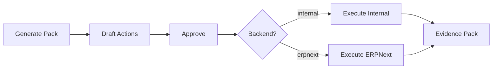

# E2E Gate — Sprint 7

## Overview

End-to-end gate proving the complete action lifecycle:
Pack Library → Draft Actions → Approval → Execute → ERPNext → Evidence Pack.

## Flow



## Test Matrix (8 tests)

| # | Test | Always Run? | Detail |
|---|------|-------------|--------|
| 1 | Generate pack → drafts | ✅ | POST /api/packs/generate |
| 2 | Fail-closed: cannot execute unapproved | ✅ | Returns 400 |
| 3 | Approve + Execute (internal) → executed | ✅ | provider=internal |
| 4 | Idempotency: re-execute returns same | ✅ | idempotent=true |
| 5 | Evidence pack has required files | ✅ | actions.json, audit.jsonl, evidence.md |
| 6 | ERPNext backend execute | ⏭ SKIP if no keys | provider=erpnext |
| 7 | ERPNext fails gracefully without keys | ✅ | provider_key_missing |
| 8 | Approval Console UI renders | ✅ | Page loads with actions |

## How to Run

```powershell
# Build first (required)
npm run build

# Run E2E gate against production server
npm run uat:e2e:prod

# Full prod release gate (includes E2E as final step)
npm run gate:all:prod
```

## Environment Variables (for ERPNext tests)

```
ERPNEXT_BASE_URL=http://localhost:8081
ERPNEXT_API_KEY=your_key
ERPNEXT_API_SECRET=your_secret
```

If not set, test 6 is **skipped** with a clear note. All other tests still **PASS**.

## Evidence Pack Output

When E2E runs, evidence is saved to:
```
data/evidence/e2e_test_ws/<packId>/
├── input.json
├── output.json
├── output.md
├── actions.json
├── audit.jsonl
├── erpnext_results.json
└── evidence.md
```
